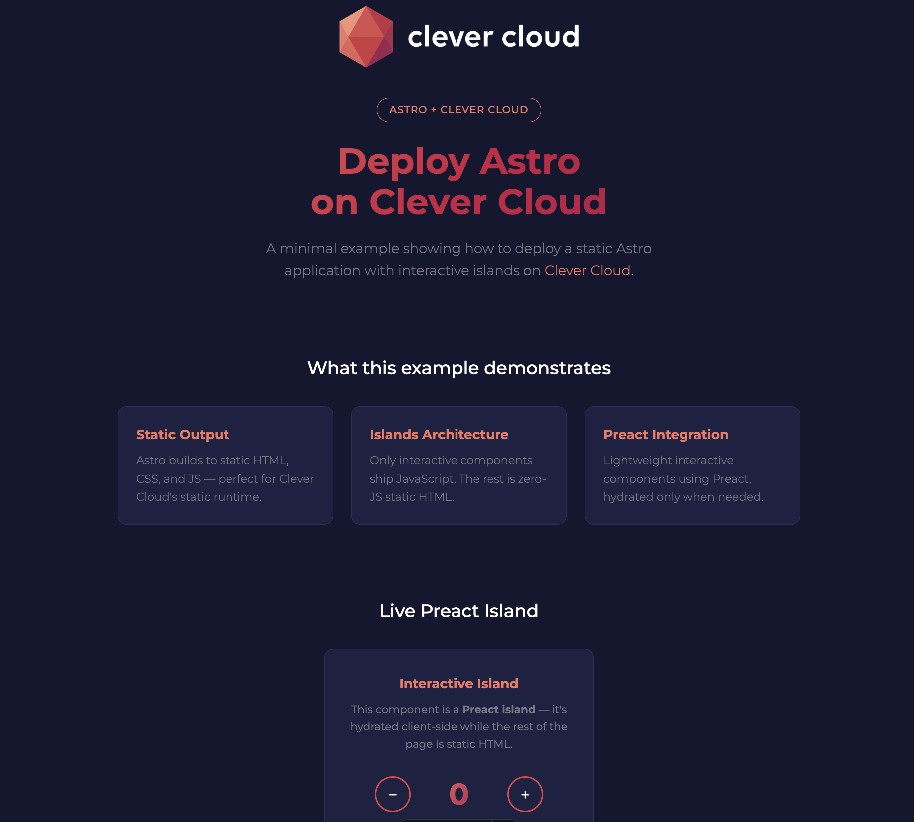

# Minimal Astro Example for Clever Cloud
[](https://clever-cloud.com)

This repository contains a minimal Astro application that can be deployed on [Clever Cloud](https://www.clever-cloud.com/). It demonstrates how to deploy a static Astro site with an interactive Preact island using Clever Cloud's [static runtime](https://www.clever.cloud/developers/doc/applications/static/).



## Project Structure

- `src/pages/index.astro` - Main page (static HTML)
- `src/components/Counter.tsx` - Interactive Preact island (client-side JS)
- `src/layouts/Layout.astro` - Shared HTML layout
- `astro.config.mjs` - Astro configuration with Preact integration
- `package.json` - Node.js project configuration

## Features

- Static site generation with Astro
- Interactive Preact island using Astro's `client:visible` directive
- Clever Cloud brand colors and Montserrat typography
- Image optimization with Sharp (responsive WebP generation)
- Zero JavaScript on static parts of the page
- Ready for deployment on Clever Cloud's static runtime

## Requirements

- Node.js 22 or later

## Local Development

To run this application locally:

```bash
npm install
npm run dev
```

The dev server will start on http://localhost:4321

To build and preview the production output:

```bash
npm run build
npm run preview
```

## Deploying to Clever Cloud

Astro builds to static HTML, so this example uses Clever Cloud's **static runtime**.

### Using the Clever Cloud CLI

1. Install the Clever Cloud CLI:
   ```bash
   npm install -g clever-tools
   ```

2. Login to your Clever Cloud account:
   ```bash
   clever login
   ```

3. Create a new static application:
   ```bash
   clever create --type static-apache <app-name>
   ```

4. Set the environment variables:
   ```bash
   clever env set CC_WEBROOT "/dist"
   clever env set SHARP_IGNORE_GLOBAL_LIBVIPS "1"
   ```

   Clever Cloud auto-detects the Astro configuration and runs the build automatically. See [Sharp image optimization on Clever Cloud](#sharp-image-optimization-on-clever-cloud) for details on the `SHARP_IGNORE_GLOBAL_LIBVIPS` variable.

5. Deploy your application:
   ```bash
   clever deploy
   ```

### Using the Clever Cloud Console

You can also deploy directly from the [Clever Cloud Console](https://console.clever-cloud.com/):

1. Create a new application in the console
2. Select **Static** as the runtime
3. Set `CC_WEBROOT` to `/dist` in the environment variables
4. Clever Cloud auto-detects Astro and builds automatically
5. Follow the deployment instructions provided in the console

### Sharp image optimization on Clever Cloud

Astro uses [Sharp](https://sharp.pixelplumbing.com/) for image optimization. Sharp ships with its own pre-compiled binaries, but when it detects a globally installed libvips on the system, it tries to rebuild against the system library instead of using its bundled ones. On Clever Cloud instances **libvips is installed globally**, so Sharp attempts this rebuild — which requires `node-gyp` and `node-addon-api`, neither of which is available by default, causing **the install to fail** (see [sharp#4498](https://github.com/lovell/sharp/issues/4498)).

There are two ways to fix this:

**Option A — Ignore system libvips (recommended)**

Set the `SHARP_IGNORE_GLOBAL_LIBVIPS` environment variable so Sharp uses its own pre-compiled binary:

```bash
clever env set SHARP_IGNORE_GLOBAL_LIBVIPS "1"
```

**Option B — Provide build dependencies for native compilation**

Install the missing build dependencies so Sharp can compile against the system libvips:

```bash
clever env set CC_PRE_BUILD_HOOK "npm install node-addon-api node-gyp sharp"
```

This works reliably but adds significant time to each build.

## Environment Variables

- `CC_WEBROOT` - Directory served by the static runtime (`/dist`)
- `SHARP_IGNORE_GLOBAL_LIBVIPS` - Set to `1` to avoid Sharp/libvips build issues (recommended)

## License

[MIT](LICENSE)

## About Clever Cloud

[Clever Cloud](https://www.clever-cloud.com/) is a European cloud provider that automates the deployment and running of applications, allowing developers to focus on code rather than infrastructure.
